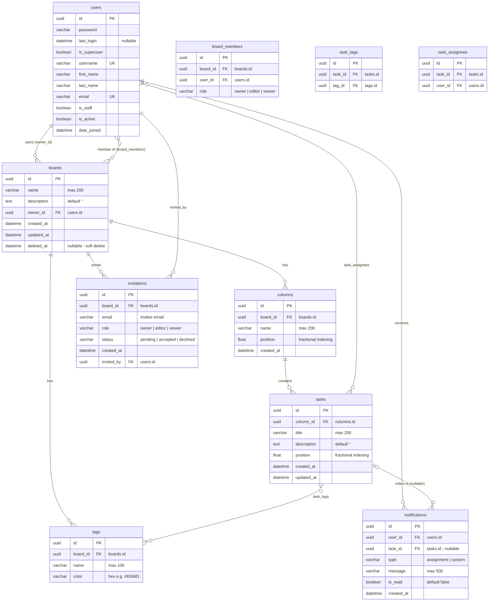

# ER Diagram — Kanban Board

**อ้างอิงจาก:** models จริงในโค้ด (`backend/accounts/models.py`, `backend/boards/models.py`)
**ฐานข้อมูล:** PostgreSQL (Docker)
**PK = Primary Key (UUID v4) · FK = Foreign Key · UK = Unique**

---

## สรุปความสัมพันธ์ (Cardinality)

| ความสัมพันธ์ | แบบ | ผ่านตาราง | หมายเหตุ |
|---|---|---|---|
| users — boards (เจ้าของ) | 1 : N | `boards.owner_id` | เจ้าของ board |
| users — boards (สมาชิก) | M : N | `board_members` | เก็บ `role` ระดับ board |
| boards — columns | 1 : N | `columns.board_id` | |
| columns — tasks | 1 : N | `tasks.column_id` | |
| boards — tags | 1 : N | `tags.board_id` | tag เป็นของ board |
| tasks — tags | M : N | `task_tags` | |
| tasks — users (ผู้รับผิดชอบ) | M : N | `task_assignees` | |
| boards — invitations | 1 : N | `invitations.board_id` | คำเชิญเข้าร่วม board |
| users — invitations | 1 : N | `invitations.invited_by` | ผู้ส่งคำเชิญ |
| users — notifications | 1 : N | `notifications.user_id` | ผู้ถูกแจ้งเตือน |
| tasks — notifications | 1 : N | `notifications.task_id` | **nullable** — notification ของ invite ไม่ผูกกับ task |

---

## จุดออกแบบที่สำคัญ

### 1. Fractional Indexing สำหรับการจัดเรียง (`position` เป็น `FloatField`)
- ทั้ง `columns.position` และ `tasks.position` ใช้ตัวเลขทศนิยมแทน integer
- เมื่อ drag หรือ drop task ไประหว่าง 2 ตำแหน่ง (เช่นระหว่าง `1.0` กับ `2.0`) ค่าใหม่ = `(1.0 + 2.0) / 2 = 1.5`
- **ผลลัพธ์:** การ reorder ทำได้โดย **update แค่ 1 แถว** (O(1)) ไม่ต้อง shift ทุกแถวใน column → ลด write load อย่างมากเมื่อ board มี task จำนวนมาก
- หมายเหตุ: ในระยะยาวถ้า float แคบเกินไป (เช่น `< 0.000001`) ต้องมี routine re-normalize สลับค่าใหม่เป็นจำนวนเต็มทั้ง column (normalization job)

### 2. Soft Delete สำหรับ Board (`deleted_at`)
- `Board.objects` (default manager) กรองแถวที่ `deleted_at IS NULL` ออก ใช้ใน API ปกติ
- `Board.all_objects` ใช้ตอนต้องการเห็นทุกแถวรวมที่ลบแล้ว
- `perform_destroy` ใน `BoardDetailView` เรียก `soft_delete()` แทนการลบจริง → รองรับการกู้คืนและ audit
- หมายเหตุ: column/task ลบจริง (hard delete) เพื่อไม่ให้ข้อมูลขยะทับถม — ระดับ board เท่านั้นที่ soft delete

### 3. โมเดล Role ระดับ Board (`board_members.role`)
- แยก `board_members` ออกจาก users/boards เพื่อเก็บ permission ระดับ board:
  - `owner` — ลบ/rename board, จัดการสมาชิก, invite, แก้ไขทุกอย่าง
  - `editor` — แก้ไข column/task/tag/assignee ได้ แต่ rename/ลบ board ไม่ได้
  - `viewer` — ดูได้อย่างเดียว
- constraint `UNIQUE(board_id, user_id)` ป้องกัน membership ซ้ำ

### 4. Constraint ระดับข้อมูล (Integrity)
- `UNIQUE(board, name)` บน columns และ tags — ป้องกัน column/tag ชื่อซ้ำใน board เดียว
- `UNIQUE(task, tag)` และ `UNIQUE(task, user)` — ป้องกัน tag/assignee ซ้ำใน task เดียว
- `users.email` และ `users.username` เป็น UK — login ด้วย email

### 5. ผู้ใช้ Login ด้วย Email
- `User` สืบทอด `AbstractUser` โดยตั้ง `USERNAME_FIELD = 'email'` → JWT login ใช้ email/password ส่วน `username` เก็บไว้แสดงผล