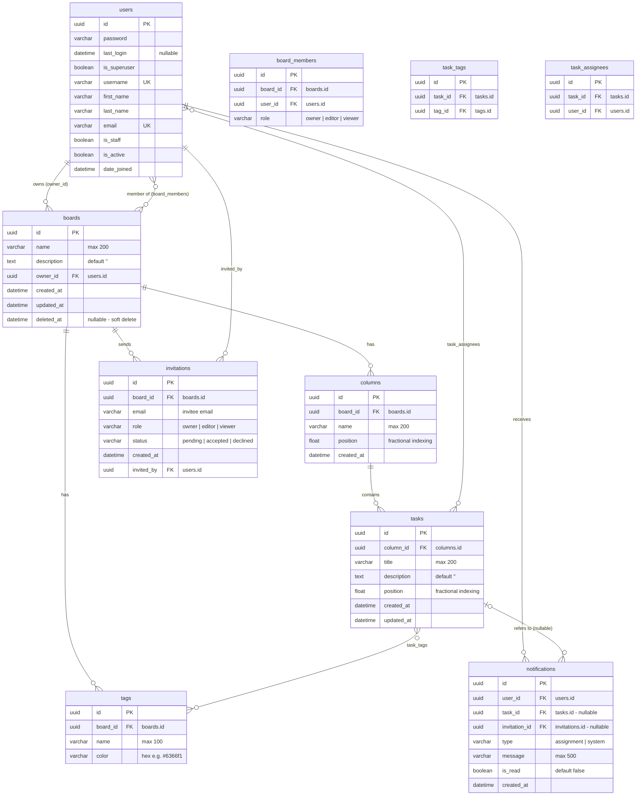

# ER Diagram — Kanban Board

**อ้างอิงจาก:** Models ที่ใช้งานจริงใน `backend/accounts/models.py` และ `backend/boards/models.py`
**Database:** PostgreSQL (Docker)
**Notation:** PK = Primary Key · FK = Foreign Key · UK = Unique Key
**Primary Key:** UUID v4



---

## 1. Relationship Overview

| Relationship            | Cardinality | Through                  | Description                                                         |
| ----------------------- | ----------- | ------------------------ | ------------------------------------------------------------------- |
| Users → Boards (Owner)  | 1 : N       | `boards.owner_id`        | ผู้ใช้หนึ่งคนสามารถเป็นเจ้าของหลาย Board                            |
| Users ↔ Boards (Member) | M : N       | `board_members`          | สมาชิกสามารถเข้าร่วมได้หลาย Board และแต่ละ Board มีสมาชิกหลายคน     |
| Boards → Columns        | 1 : N       | `columns.board_id`       | Board หนึ่งมีหลาย Column                                            |
| Columns → Tasks         | 1 : N       | `tasks.column_id`        | Column หนึ่งมีหลาย Task                                             |
| Boards → Tags           | 1 : N       | `tags.board_id`          | Tag ถูกกำหนดอยู่ภายใต้ Board                                        |
| Tasks ↔ Tags            | M : N       | `task_tags`              | Task สามารถมีหลาย Tag และ Tag สามารถถูกใช้กับหลาย Task              |
| Tasks ↔ Users           | M : N       | `task_assignees`         | Task สามารถมอบหมายให้หลาย User                                      |
| Boards → Invitations    | 1 : N       | `invitations.board_id`   | Board สามารถมี Invitation หลายรายการ                                |
| Users → Invitations     | 1 : N       | `invitations.invited_by` | User สามารถเป็นผู้ส่ง Invitation หลายรายการ                         |
| Users → Notifications   | 1 : N       | `notifications.user_id`  | User สามารถมี Notification หลายรายการ                               |
| Tasks → Notifications   | 1 : N       | `notifications.task_id`  | Notification สามารถอ้างอิง Task ได้ โดยเป็นความสัมพันธ์แบบ Nullable |
| Invitations → Notifications | 1 : N   | `notifications.invitation_id` | Invitation สามารถเชื่อมโยงกับ Notification ได้ (Linked notification สำหรับ invitation event) |

---

## 2. Design Decisions

### 2.1 Fractional Indexing สำหรับการจัดลำดับ

ฟิลด์ `position` ของทั้ง `columns` และ `tasks` ใช้ `FloatField` เพื่อรองรับการจัดลำดับแบบ **Fractional Indexing**

ตัวอย่าง เมื่อ Task ถูกลากไปอยู่ระหว่าง Task ที่มี Position `1.0` และ `2.0`:

```text
new_position = (1.0 + 2.0) / 2
             = 1.5
```

ข้อดีของแนวทางนี้คือสามารถเปลี่ยนลำดับของ Task ได้โดย **Update เฉพาะ Row ที่ถูกย้าย** แทนการปรับ Position ของ Task ทุกตัวที่อยู่ถัดลงไป

```text
Traditional Integer Ordering

Task A = 0
Task B = 1
Task C = 2
Task D = 3

Move D → between A and B

ต้อง Update:
B → 2
C → 3
D → 1


Fractional Indexing

Task A = 0
Task B = 1
Task C = 2
Task D = 3

Move D → between A and B

D → 0.5

Update เพียง 1 Row
```

**ผลลัพธ์:** ลดจำนวน Database Write ในการ Reorder และช่วยให้ระบบรองรับ Board ที่มี Task จำนวนมากได้ดีขึ้น

> **Long-term consideration:** หากค่าระหว่าง Position มีขนาดเล็กลงเรื่อย ๆ จากการ Insert ซ้ำ ๆ ระบบควรมี Normalization/Rebalancing Routine เพื่อจัดลำดับ Position ใหม่เป็นช่วงที่เหมาะสม

---

### 2.2 Soft Delete สำหรับ Board

Board ใช้แนวทาง **Soft Delete** ผ่านฟิลด์:

```text
deleted_at
```

เมื่อ Board ถูกลบ ระบบจะบันทึกเวลาที่ลบแทนการลบ Row ออกจาก Database โดยตรง

การเข้าถึงข้อมูลแบ่งเป็น:

```text
Board.objects
    ↓
เฉพาะ Board ที่ deleted_at IS NULL

Board.all_objects
    ↓
รวมทั้ง Board ที่ถูก Soft Delete
```

ใน `BoardDetailView` การลบ Board จะเรียก `soft_delete()` แทนการทำ Hard Delete

**ข้อดี**

* สามารถรองรับการกู้คืนข้อมูลในอนาคต
* ลดความเสี่ยงจากการลบข้อมูลโดยไม่ตั้งใจ
* สามารถใช้เป็นข้อมูลสำหรับ Audit/Recovery ได้

สำหรับ `Column` และ `Task` ระบบใช้ **Hard Delete** เนื่องจากเป็นข้อมูลที่อยู่ภายใต้ Lifecycle ของ Board และไม่จำเป็นต้องเก็บข้อมูลที่ถูกลบไว้ในระบบถาวร

---

### 2.3 Board-Level Role & Permission

ระบบแยกข้อมูลสมาชิกออกมาไว้ใน `board_members` เพื่อรองรับ Role และ Permission ในระดับ Board

```text
board_members
├── board_id
├── user_id
└── role
```

Role ที่รองรับ:

| Role       | สิทธิ์                                                       |
| ---------- | ------------------------------------------------------------ |
| **owner**  | จัดการ Board, สมาชิก และ Invitation รวมถึงแก้ไขข้อมูลทั้งหมด |
| **editor** | แก้ไข Column, Task, Tag และ Assignee                         |
| **viewer** | อ่านข้อมูล Board ได้ แต่ไม่สามารถแก้ไขข้อมูล                 |

การแยก Role ออกจาก `users` ทำให้ User คนเดียวสามารถมี Role แตกต่างกันในแต่ละ Board ได้

ตัวอย่าง:

```text
User A
├── Board A → owner
├── Board B → editor
└── Board C → viewer
```

มี Constraint:

```text
UNIQUE(board_id, user_id)
```

เพื่อป้องกัน User คนเดียวกันถูกเพิ่มเข้า Board เดียวกันซ้ำ

---

### 2.4 Database Integrity Constraints

ระบบใช้ Database Constraint เพื่อรักษาความถูกต้องของข้อมูลในระดับ Database

#### Column และ Tag

```text
UNIQUE(board, name)
```

ป้องกันชื่อ Column หรือ Tag ซ้ำกันภายใน Board เดียวกัน

ตัวอย่าง:

```text
Board A
├── To Do       ✓
├── In Progress ✓
└── To Do       ✗ duplicate
```

#### Task Tags

```text
UNIQUE(task, tag)
```

ป้องกันการเพิ่ม Tag เดิมเข้า Task ซ้ำ

#### Task Assignees

```text
UNIQUE(task, user)
```

ป้องกันการ Assign User คนเดิมให้ Task เดียวกันซ้ำ

#### User

```text
UNIQUE(email)
```

ป้องกันบัญชีที่ใช้ Email หรือ Username ซ้ำกัน

---

### 2.5 Email-Based Authentication

User Model สืบทอดจาก Django `AbstractUser` และกำหนดให้ Email เป็น Identifier หลักสำหรับ Authentication:

```text
USERNAME_FIELD = "email"
```

ดังนั้น Flow การ Login ของระบบคือ:

```text
Email + Password
       ↓
Authentication
       ↓
JWT Access Token + Refresh Token
```

ขณะที่ `username` ยังคงถูกเก็บไว้สำหรับใช้เป็น Display Name ภายในระบบ

---

## 3. Data Ownership

โครงสร้างข้อมูลกำหนด Ownership เป็นลำดับชั้นดังนี้:

```text
User
 │
 ├── owns → Board
 │            │
 │            ├── Columns
 │            │      └── Tasks
 │            │
 │            ├── Tags
 │            │
 │            ├── Members
 │            │
 │            └── Invitations
 │
 └── receives → Notifications
                    │
                    └── optionally references → Task
```

แนวทางนี้ทำให้สามารถตรวจสอบสิทธิ์จาก **Board Ownership → Membership → Resource** ได้อย่างชัดเจน และช่วยป้องกันการเข้าถึงข้อมูลข้าม Board

---

## 4. Design Summary

Database Schema ถูกออกแบบโดยเน้น 4 ประเด็นหลัก:

1. **Data Integrity** — ใช้ Foreign Key และ Unique Constraint ป้องกันข้อมูลไม่สอดคล้องกัน
2. **Authorization** — แยก Board Membership และ Role เพื่อควบคุมสิทธิ์ในระดับ Resource
3. **Efficient Reordering** — ใช้ Fractional Indexing เพื่อลดจำนวน Database Write ในการ Drag & Drop
4. **Data Recovery** — ใช้ Soft Delete สำหรับ Board เพื่อรองรับ Recovery และ Audit ในอนาคต
