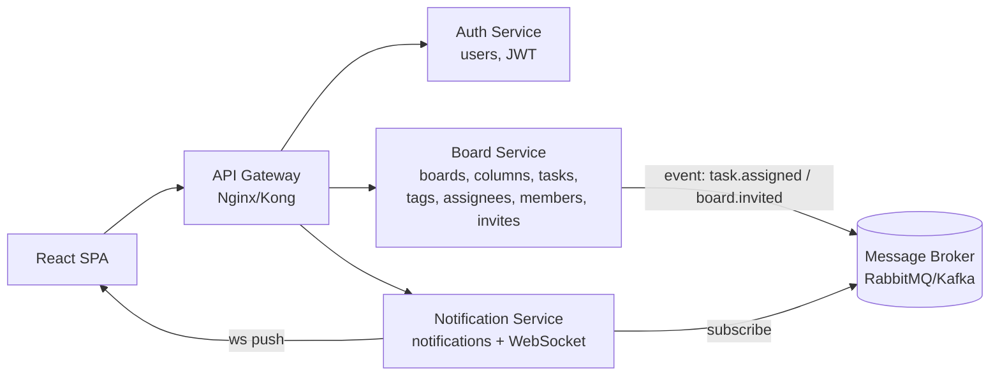

# Performance & Microservice Architecture

**อ้างอิงจาก:** สิ่งที่ implement จริงแล้วในโค้ด + แผนปรับปรุง + สถาปัตยกรรมระยะยาว (สำหรับสมัครตำแหน่ง Back-End Developer)

---

## 1. Tech Stack ที่ใช้จริง

| ชั้น | เทคโนโลยี | บทบาท |
|---|---|---|
| Backend | **Python 3 + Django 5 + Django REST Framework** | REST API ทั้งระบบ (เลือก Django เพราะมี ORM/Admin/Perf บังคับเสร็จ, DRF serializer + validation เป็นระบบ, ecosystem มี `select_related`/`prefetch_related`, auth แน่นหนา) |
| Auth | **SimpleJWT (access + refresh token)** | Stateless, ต่อยอด horizontal scale ได้ |
| Database | **PostgreSQL 16** | รองรับ FK constraint, transaction, index แนวตั้ง (และอ่าน JSONB ได้ถ้าต้องการ) |
| Frontend | **React 18 + Vite** | SPA — backend ป็น pure JSON API |
| Container | **Docker Compose** | 5 ตัว: db, backend, frontend, pgadmin |
| Notification | **Polling REST (5 วิ)** ตอนนี้ | (แผน: WebSocket ดูหัวข้อ 3.3) |

---

## 2. การออกแบบที่ช่วย Performance อยู่แล้วในโค้ดจริง

### 2.1 Fractional Indexing สำหรับ reorder — ลด write จาก O(n) → O(1)
`tasks.position` / `columns.position` เป็น float วางระหว่าง 2 ค่า (ค่าเฉลี่ย) → ย้าย task ใน board ใหญ่แต่ละครั้ง **update แค่ 1 แถว** (โค้ด: `TaskMoveView` + `insertionPosition` ฝั่ง frontend) แทนการ shift ทั้ง column

### 2.2 จัดการ N+1 query ล่วงหน้า
- `TaskSerializer.get_assignees` / `get_tags` ใช้ `select_related('user')` / `select_related('tag')`
- `ColumnTaskListCreateView.get_queryset` → `select_related('column').prefetch_related('assignees__user', 'tag_links__tag')`
- `BoardSummarySerializer.get_members` → `select_related('user')`

### 2.3 Soft delete ระดับ Board
ลบ board = `UPDATE boards SET deleted_at=...` แทน DELETE แบบ cascade → ไม่มี update storm บน FK หลายตาราง, ดูข้อมูลย้อนหลัง (audit) ได้

### 2.4 Notification ตัดจำนวน
`NotificationListView` ตัดที่ `[:50]` → response เล็กเสมอ ไม่มีทางได้ payload โตไม่รู้จบ

### 2.5 Selectivity ของ query
ทุก query เริ่มจาก `request.user` เสมอ (board list กรอง `Q(owner=user) | Q(members__user=user)`) → data isolation + result set เล็ก

---

## 3. แผนเพิ่ม Performance (เขียนอธิบายตามที่ Requirement ต้องการ)

### 3.1 Database Indexing (มีผลสูง ต้นทุนต่ำ)
ตอนนี้มี index อัตโนมัติจาก PK/UK/FK และ `UNIQUE(board,name)` เท่านั้น เพิ่ม composite index:

| ตาราง | Index | เหตุผล |
|---|---|---|
| tasks | `(column_id, position)` | query เรียง task ใน column เดียวเร็วขึ้น (ใช้ sorting + range) |
| columns | `(board_id, position)` | เดียวกับข้างบน |
| notifications | `(user_id, created_at)` | filter + sort ของ "แจ้งเตือนของฉัน" (หน้าแรก) |
| invitations | `(email, status)` | ค้นหาคำเชิญ pending ของ email |

วิธีทำ: migration ใหม่ใน Django (`Meta.indexes`) — ไม่ต้องแตะ logic

### 3.2 กำจัด N+1 ที่ยังเหลือใน Board Detail (จุดที่เจอในโค้ดจริง)
`GET /boards/{id}` (BoardDetailSerializer) ฝัง columns → tasks → assignees/tags ซึ่งตอนนี้ **ไม่ได้** prefetch ชั้นใน–ใน → board ใหญ่จะรัน query ซ้ำต่อ task หลายสิบครั้ง แก้ด้วย `prefetch_related`:

```python
Board.objects.prefetch_related(
    'columns__tasks__assignees__user',
    'columns__tasks__tag_links__tag',
    'members__user',
    'tags',
)
```
แถม `BoardSummarySerializer.get_column_count/get_task_count` อ่านครั้งละ 1 query ต่อ board (ได้ 2N+1 query ตอน list) → เปลี่ยนเป็น `Count` annotation:

```python
from django.db.models import Count
qs = Board.objects.annotate(
    column_count=Count('columns', distinct=True),
    task_count=Count('columns__tasks', distinct=True),
)
```

### 3.3 Real-time Notification แทน Polling (5 วิ → WebSocket)
- ปัจจุบัน: `useNotifications.js` poll `GET /notifications` ทุก 5 วินาที → load เฉลี่ยต่อ client ~0.2 req/s (server ยังรับไหว แต่ latency รับรู้ช้า + เปลือง token)
- แผน: **Django Channels + daphne + Redis channel layer** เปิด `ws://.../ws/notifications/`
- เมื่อ `TaskAssigneeChangeView` หรือ `BoardInviteView` สร้าง Notification → `channel_layer.group_send` → push ทันทีที่ client ที่เกี่ยวข้อง
- เก็บ polling ไว้เป็น fallback (เฉพาะ tab ที่ถูก suspend แล้วกลับมา ใช้ catch-up)

### 3.4 Redis Cache สำหรับ Board Detail (cache-aside)
- board detail (ข้อมูลอ่านเยอะ เขียนน้อย) → cache ที่ Redis key `board:{id}:v{version}`
- invalidate ด้วย Django signal (`post_save`/`post_delete` บน Board/Column/Task/Tag/BoardMember/… → `cache.delete` ตาม `board_id` ที่ cascade ถึง)
- รองรับหลาย instance (Redis ตัวเดียวกัน) และยังไม่เสียความสดของข้อมูล
- *หมายเหตุ:* ถ้าอยากได้แบบ soft-consistency เสมอ การเลื่อนผ่าน index + auto-scaling ของ Postgres ก็คุ้มค่ากว่าถ้า cache miss บ่อย

### 3.5 Pagination แนว Cursor
- `/notifications` (โตไม่หยุด) → ใช้ DRF `CursorPagination` (เสถียรตอนมีแถวใหม่แทรกระหว่างหน้า ต่างจาก page number)
- `/boards` / `/boards/{id}/columns` ถ้าต้องการรองรับ board นับร้อย column → cursor เช่นกัน

### 3.6 Connection / Resource tuning
- ตั้ง `CONN_MAX_AGE` (persistent connection ต่อ Postgres) ลด connection churn
- ขั้นมากกว่า 1 instance → ใส่ **PgBouncer** หน้า Postgres (transaction pooling) ป้องกัน connection หมด
- ใส่ **Gunicorn** (workers = 2×CPU) แทน dev server สำหรับ production

### 3.7 Bulk write สำหรับ assign หลายคน / import
`bulk_create` notification/member หลายแถวใน query เดียว แทน loop insert

### 3.8 Async สำหรับงานที่ไม่บล็อก response
ส่ง notification / re-normalize position หลัง drag — ย้ายเป็น background task (`django-q` / Celery + Redis) → response หลักของ `PATCH /tasks/{id}/move` ไม่รองานเสริม

---

## 4. Microservice Architecture

Requirement ระบุ "หากทำแบบ Microservice จะพิจารณาเป็นพิเศษ" → ขอเสนอทั้งคำตอบตรง ๆ และแบบที่ทำได้จริง

### 4.1 คำตอบตรง ๆ (ข้อแนะนำ)
ด้วย scope ของระบบนี้ (ไม่เกิน 2–4 table cluster, user นับร้อย) **Modular Monolith คือคำตอบที่ถูกต้อง**: ความซับซ้อนเชิงระบบ (distributed transaction, observability, deploy pipeline, network latency) ยังแพงกว่าประโยชน์ที่ได้ และ **monolith นี้ถูกแบ่ง bounded context ไว้แล้ว** (`accounts` / `boards` เป็น Django app คนละ app + ใช้ event ของ Django signal แยกจุดเชื่อม) ทำให้แยกเป็น service ทีหลังได้โดยไม่ต้อง refactor ใหญ่

### 4.2 ถ้าต้องทำ microservice จริง (design ที่ใช้ได้)

**Service split ตาม bounded context (DB แยกกันคนละตัว — Database per Service):**



| Service | หน้าที่ | เจ้าของข้อมูล (DB) |
|---|---|---|
| **Auth Service** | register/login/refresh/me, JWT issue | users |
| **Board Service** | CRUD board/column/task/tag + assignee/member/invite | boards, columns, tasks, tags, task_tags, task_assignees, board_members, invitations |
| **Notification Service** | รับ event → สร้าง notification → push WebSocket | notifications |
| **API Gateway** | routing, JWT ตรวจร่วม, rate limiting | — |

**การสื่อสารระหว่าง service:**
- **Synchronous** (เฉพาะอ่านที่ต้องสดจริง): Auth ↔ Board ผ่าน REST ของ gateway
- **Asynchronous** (งานที่ยอม delay): Board Service publish event ใส่ broker (`task.assigned`, `board.invited`, `member.joined`) → Notification Service consume แล้วสร้าง record + push WS
- **ถ้า Notification Service ล่ม** → งานหลัก (สร้าง/ย้าย task) ไม่กระทบ เพราะ event ขังคิวไว้รอ consume ทีหลัง → resilience

**Consistency ข้าม service:**
- **Outbox Pattern:** ตอน Board Service เขียน transaction หลัก (เช่น assign task) ให้แทรก event ในตาราง `outbox` ภายใน transaction เดียวกัน → background worker ส่ง/ack event ให้ broker → กันเหตุการณ์ "เขียนงานสำเร็จแต่ event ไม่ส่ง"
- **Saga สำหรับ cross-service mutation:** เช่น "accept invitation" = update invitation + create board_member + notify — ถ้าอยู่คนละ service ใช้ Saga (compensation) หรือถ้ายอม trade-off ก็ให้ board_member อยู่กับ Board Service แล้ว Notification Service ฟัง event ทีหลัง (eventual consistency — ยอมรับได้เพราะ notification ยอม delay)

**Operational และ trade-off ที่ต้องยอมรับ (บอกไว้ตรง ๆ):**
- เพิ่ม moving parts: message broker, deployment ต่อ service, service discovery, tracing (เช่น OpenTelemetry) — ค่าใช้จ่ายคงที่สูง
- Distributed debugging ยากขึ้น, API ระหว่าง service มี network latency + versioning (contract ต้อง strict — ใช้ OpenAPI)
- **ข้อสรุป:** เลือกใส่ Modular Monolith (พร้อม seam แยก service) ไปก่อน และขยับเป็น microservice เฉพาะเมื่อ metric บอกว่าต้อง (เช่น scaling เฉพาะ Notification ตัวเดียว, ทีมหลายชุดอยาก deploy แยก) — ซึ่งตอนนั้นมี broker + outbox + bounded context เตรียมไว้แล้ว

---

## 5. สรุปสิ่งที่ Requirement ต้องการ

| หัวข้อ | สถานะ |
|---|---|
| ER Diagram — เอกสาร | ✅ `docs/er-diagram.md` (ตรงกับ models จริง, incl. cardinality + design notes) |
| ออกแบบ Request/Response เป็นระบบ | ✅ `docs/api-design.md` (convention + ทุก endpoint พร้อมตัวอย่างทั้ง success/error, ตรงกับ serializer/view จริง) |
| เทคโนโลยีเพิ่ม Performance + คำอธิบาย | ✅ ทั้งที่ทำแล้ว (fractional indexing, N+1 fix, soft delete) และแผน (index, cache, WS, cursor, bulk, async) |
| Microservice Architecture | ✅ อธิบายถูกต้องทั้งความคุ้มค่า + design แบบต่อยอด (service split, broker, outbox, saga) |
